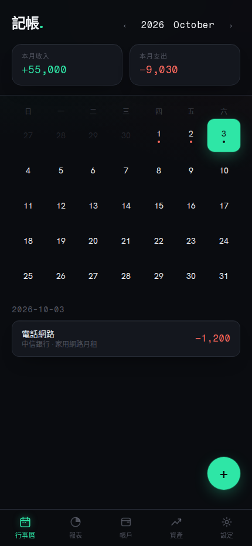
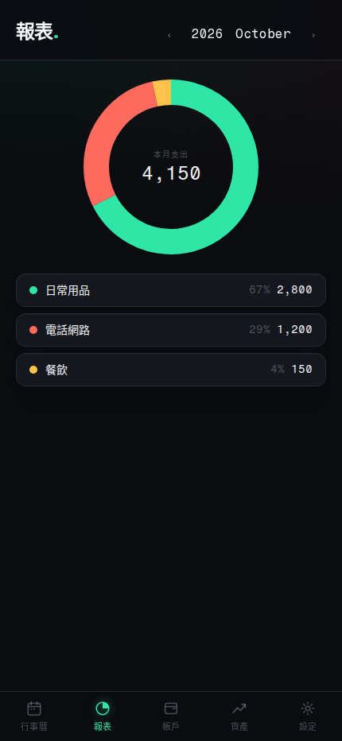
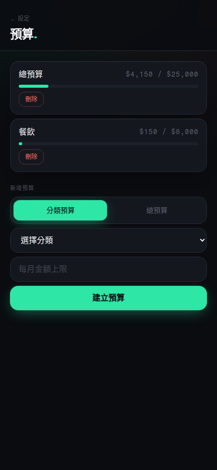
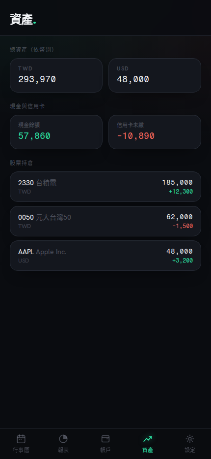

# ledger-app

個人記帳系統。FastAPI + Next.js 全端專案，用行為驅動開發（BDD／Gherkin）把每一條記帳規則都寫成可執行的規格，並整合兩個外部系統把記帳自動化：一邊是獨立的投資日誌系統 [stock_analyzer](https://github.com/daniel0307tw/stock_analyzer)（股票交易即時同步成現金異動、股票持倉即時估值），另一邊是自己架設的 AI agent **Hermes**（收據照片辨識、雲端發票比對分類，自動建立收支紀錄）。

不是玩具專案的記帳 CRUD——重點在把「代墊款怎麼算」「哪些花費算進預算」這類容易口頭講清楚、實際寫規格卻很多陷阱的業務規則，用 BDD 收斂成無歧義、可回歸測試的規格，並在新增功能時系統性地檢查這些規則有沒有被正確套用到所有相關的地方（後端查詢、編輯邏輯、前端統計）。

## 功能

- **收支紀錄**：新增／編輯／刪除，帳戶、分類、轉帳
- **代墊款**：標記某筆支出為代墊款、確認收到還款、待收回清單——結清前後「有效金額」的計算規則貫穿預算、報表、行事曆多處，是這個專案裡最容易踩雷也最值得寫測試的地方
- **預算**：月度預算設定與執行狀況追蹤
- **報表**：分類花費統計、分類明細鑽取（點分類看該分類底下每一筆交易）
- **固定收支**：週期性交易規則
- **股票整合（stock_analyzer）**：雙向串接——① 使用者在 stock_analyzer 記錄一筆股票交易，若券商對應到現金帳戶，stock_analyzer 會即時推送現金異動，ledger-app 自動建立／更新／刪除對應的記帳交易（標記為 `isStockSync`，不計入一般報表，也不會跟既有的 CashPosition 反向同步機制互相觸發造成雙重寫入）；② 資產總覽頁下拉刷新即時抓 stock_analyzer 的股票持倉市值（唯讀 API），現金、信用卡、股票一次看
- **Hermes agent 自動記帳**：自己部署的第三方 AI agent，代表使用者透過 API 直接寫入記帳紀錄，不是 ledger-app 內建邏輯——收到收據／發票照片（Telegram）時用 vision 辨識金額與商家，查有無相似金額的既有紀錄，確認不是重複才自動建立交易
- **雲端發票同步**：掃描同步資料夾裡的發票 CSV，自動建立收支紀錄，並用「關鍵字規則 → Hermes（LLM）建議分類 → 預設分類」三層機制自動歸類

## 畫面

> 以下為另外起的隔離 demo 資料庫截圖（假帳戶／假交易／假持倉），不是正式環境的真實財務資料。

| 行事曆 | 報表 |
|---|---|
|  |  |

| 預算 | 資產總覽（含股票整合） |
|---|---|
|  |  |

## 技術棧

| 層 | 技術 |
|---|---|
| 後端 | FastAPI, SQLAlchemy, Alembic, PostgreSQL |
| 前端 | Next.js (App Router), TypeScript, Tailwind CSS, Zod |
| 測試 | Behave（後端 BDD，Gherkin 規格對照 `specs/`）、Cucumber.js + Playwright（前端 E2E）、MSW（前端 mock） |
| 規格驅動 | `specs/erm.dbml`（資料模型）、`specs/api.yml`（API 契約）、`tests/features/**/*.feature`（業務規則，唯一事實來源） |

## 專案結構

```
app/                後端：models / repositories / services / api（分層架構）
web/                前端：Next.js App Router，src/app 為頁面、src/lib 為 API client + 型別
specs/              erm.dbml（實體模型）、api.yml（API 契約）——皆由 .feature 規格推導產生；actors/ 記錄 stock_analyzer、Hermes 這類外部 Actor 的呼叫關係與邊界
tests/features/     Gherkin 規格 + step definitions，behave 執行，唯一事實來源
plans/              各功能開發時的執行計畫存檔（BDD spec → entity → API → TDD 的分階段紀錄）
```

## 開發流程

規則不是先寫程式碼再補測試，而是先用 Gherkin 把規則寫清楚（含具體數字範例），資料模型、API 契約、實作都從規格反推。順序大致是：

1. 需求拆解成 `Rule` + 具體 `Example`（尤其金額類公式，動手寫規格前先用實際數字驗證一次，避免規格本身就是錯的）
2. 從 Feature 檔案推導 `erm.dbml`（資料模型）與 `api.yml`（API 契約）
3. Red → Green → Refactor 循環實作後端
4. 前端依 `api.yml` 建 mock（MSW）與型別，Cucumber E2E 先在 mock 模式全綠
5. 串接真實後端做 Integration Validation

`plans/` 底下留著每個功能實際跑過這個流程的紀錄，可以看到規則怎麼從一句話收斂成測試案例。

## 執行

```bash
# 後端
python -m venv .venv && source .venv/bin/activate
pip install -r requirements.txt
alembic upgrade head
uvicorn app.main:app --reload --port 8001

# 測試
behave tests/features/

# 前端
cd web
npm install
npm run dev       # http://localhost:3001，預設連真實後端
npm run test       # Cucumber E2E（NEXT_PUBLIC_MOCK_API=true 時走 MSW mock）
npm run typecheck
```

資產頁的股票即時報價功能需要另外跑 [stock_analyzer](https://github.com/daniel0307tw/stock_analyzer) 的唯讀 API（`run_api_server.sh`，預設 `127.0.0.1:8100`）；沒有這個服務時資產頁會正常顯示，只是股票持倉那塊會回傳查詢失敗，不影響其他功能。

## 這個專案想展示的能力

- **把模糊的口頭需求收斂成無歧義規格**：例如「代墊款結清後要怎麼算」這種規則，光用文字講很容易漏掉邊界情況（金額改了要不要取消結清？刪除還款交易要不要復原原本的代墊款狀態？），用 Gherkin Rule + 具體數字 Example 逼自己把每個分支都想清楚，動手寫程式前就先用真實數字回推一次公式對不對。
- **規則一致性稽核**：同一條業務規則（代墊款有效金額）分別出現在資料庫查詢、編輯交易的狀態轉換、前端行事曆統計三個地方，新增功能或修 bug 時系統性地檢查所有相依位置，而不是改完一處就假設其他地方自動正確。
- **跨系統整合，同時考慮成本**：ledger-app 的資產頁需要即時股價，但股價 API 有速率限制／計費，串接另一個獨立系統（stock_analyzer）時明確把「使用者主動下拉才觸發」寫進設計，而不是預設進頁面就自動打 API。
- **正確處理瀏覽器層級的細節**：手勢類 UI（下拉刷新）在 React 上有 passive event listener 的坑——用 JSX 掛 `onTouchMove` 呼叫 `preventDefault()` 在真機上會靜默失效，必須用原生 `addEventListener` 手動關掉 passive 才擋得住瀏覽器原生的下拉重整動作。
- **營運安全意識**：本機測試前先檢查有沒有相同 port 的正式環境服務在跑（避免 port 衝突把正式服務打掉），資料修正一律透過應用層 API（而非直接改資料庫）以確保觸發到既有的業務邏輯與副作用。
- **多 Actor 系統的規格設計**：除了人類使用者，stock_analyzer、Hermes 這兩個第三方系統都會直接呼叫 ledger-app 的 API 寫入資料；在 `specs/actors/` 把每個 Actor 的身分、呼叫方向、信任邊界（目前比照既有慣例，無認證層，靠網路邊界限制僅 127.0.0.1 可呼叫）寫清楚，並在 BDD 規格裡明確標記「這筆交易是誰建立的」（如 `isStockSync`），避免多個寫入來源互相觸發造成雙重同步。

想看更完整的技能清單（含各項技能對應的具體案例），見 [`.claude/skills/`](.claude/skills/)。
